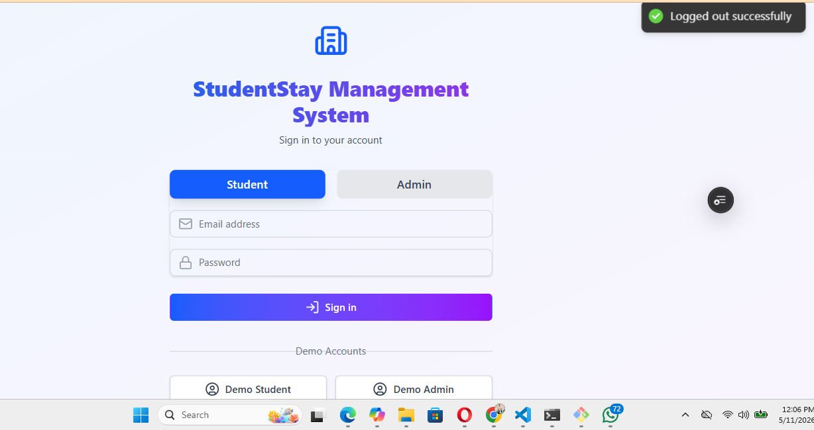

<div align="center">
  
  <h1>🏠 Student Accommodation Management System</h1>
  <p><strong>Streamline. Simplify. Succeed.</strong></p>
  <p>A modern, high-performance web application designed to manage student housing facilities with elegance and efficiency.</p>
</div>

---

## 🔗 Live Demo

<div align="center">
  <a href="https://student-accommodation-app.vercel.app" target="_blank">
    
  </a>
  <br/>
  <sub>Click above to explore the live application</sub>
</div>

---

## 📚 Table of Contents

<div align="center">
  <table>
    <tr>
      <td width="50%">
        <details open>
          <summary><strong>📋 Project Overview</strong></summary>
          <ul>
            <li><a href="#overview">✨ Overview</a></li>
            <li><a href="#core-benefits">🎯 Core Benefits</a></li>
            <li><a href="#screenshots">📸 Screenshots</a></li>
          </ul>
        </details>
      </td>
      <td width="50%">
        <details open>
          <summary><strong>🛠️ Technical</strong></summary>
          <ul>
            <li><a href="#tech-stack">💻 Tech Stack</a></li>
            <li><a href="#project-structure">📁 Project Structure</a></li>
            <li><a href="#getting-started">🚀 Getting Started</a></li>
          </ul>
        </details>
      </td>
    </tr>
    <tr>
      <td width="50%">
        <details open>
          <summary><strong>🧭 Modules</strong></summary>
          <ul>
            <li><a href="#student-management">👨‍🎓 Student Management</a></li>
            <li><a href="#room-management">🛏️ Room Management</a></li>
            <li><a href="#payment-tracking">💳 Payment Tracking</a></li>
            <li><a href="#maintenance">🛠️ Maintenance</a></li>
            <li><a href="#dashboard">📊 Dashboard</a></li>
          </ul>
        </details>
      </td>
      <td width="50%">
        <details open>
          <summary><strong>📄 Documentation</strong></summary>
          <ul>
            <li><a href="#environment-variables">🔧 Environment Variables</a></li>
            <li><a href="#deployment">🚀 Deployment</a></li>
            <li><a href="#license">📄 License</a></li>
            <li><a href="#contact">📧 Contact</a></li>
          </ul>
        </details>
      </td>
    </tr>
  </table>
</div>

---

<div align="center">
  
  
  
  
  
  
</div>

---

## ✨ Overview {#overview}

Say goodbye to chaotic spreadsheets and disconnected systems. The **Student Accommodation Management System** brings all your daily operational tasks into one **sleek, intuitive dashboard**. Designed for administrators and staff, this system transforms how you manage students, rooms, finances, and maintenance.

**Core Benefits:** {#core-benefits}
- 🚀 **Lightning Fast** – Powered by Vite + React
- 🎯 **Intuitive UI** – Clean, modern interface
- 📱 **Fully Responsive** – Works on any device
- 🔒 **Secure & Reliable** – Built with best practices

---

## 🧭 Core Modules {#modules}

<div align="center">
  <table>
    <tr>
      <td align="center" width="25%">
        
        <br/>
        <strong id="student-management">👨‍🎓 Student Management</strong>
        <br/>
        <sub>Add, manage, and assign students to rooms</sub>
      </td>
      <td align="center" width="25%">
        
        <br/>
        <strong id="room-management">🛏️ Room Management</strong>
        <br/>
        <sub>Track availability & occupancy status</sub>
      </td>
      <td align="center" width="25%">
        
        <br/>
        <strong id="payment-tracking">💳 Payment Tracking</strong>
        <br/>
        <sub>Record payments & manage balances</sub>
      </td>
      <td align="center" width="25%">
        
        <br/>
        <strong id="maintenance">🛠️ Maintenance</strong>
        <br/>
        <sub>Log & track maintenance requests</sub>
      </td>
    </tr>
  </table>
</div>

### 📊 Dashboard Overview {#dashboard}
Your command center at a glance:
- **Total Students** – Current occupancy count
- **Room Occupancy** – Live availability metrics
- **Payment Overview** – Real-time financial snapshot
- **Maintenance Activity** – Active & pending requests

---

## 🛠️ Tech Stack {#tech-stack}

<div align="center">
  <table>
    <tr>
      <th>Category</th>
      <th>Technologies</th>
    </tr>
    <tr>
      <td><strong>🎨 Frontend</strong></td>
      <td>React 18 • Vite • Tailwind CSS • React Router • Axios</td>
    </tr>
    <tr>
      <td><strong>⚙️ Backend</strong></td>
      <td>Node.js • Express • REST API</td>
    </tr>
    <tr>
      <td><strong>🗄️ Database</strong></td>
      <td>PostgreSQL • Prisma ORM</td>
    </tr>
    <tr>
      <td><strong>🚀 Deployment</strong></td>
      <td>GitHub • Vercel (Frontend) • Render/Heroku (Backend)</td>
    </tr>
  </table>
</div>

---

## 📸 Screenshot Gallery {#screenshots}

<div align="center">
  <table>
    <tr>
      <td align="center" width="50%">
        
        <br/>
        <strong>📊 Dashboard</strong>
        <br/>
        <sub>Key metrics at a glance</sub>
      </td>
      <td align="center" width="50%">
        
        <br/>
        <strong>👨‍🎓 Student Management</strong>
        <br/>
        <sub>Manage all student records</sub>
      </td>
    </tr>
    <tr>
      <td align="center" width="50%">
        
        <br/>
        <strong>🛏️ Room Management</strong>
        <br/>
        <sub>Track occupancy & availability</sub>
      </td>
      <td align="center" width="50%">
        
        <br/>
        <strong>💳 Payment Tracking</strong>
        <br/>
        <sub>Monitor financial status</sub>
      </td>
    </tr>
    <tr>
      <td align="center" colspan="2">
        
        <br/>
        <strong>🛠️ Maintenance Requests</strong>
        <br/>
        <sub>Track issue resolution workflow</sub>
      </td>
    </tr>
  </table>
</div>

---

## 📁 Project Structure {#project-structure}

```bash
src/
├── components/          # Reusable UI components
│   ├── DashboardCard.jsx
│   ├── StudentTable.jsx
│   └── Navbar.jsx
├── pages/              # Main views
│   ├── Dashboard.jsx
│   ├── Students.jsx
│   ├── Rooms.jsx
│   ├── Payments.jsx
│   └── Maintenance.jsx
├── layouts/            # Layout wrappers
├── services/           # API calls
├── context/            # React context providers
├── hooks/              # Custom hooks
├── App.jsx
├── main.jsx
└── index.css
